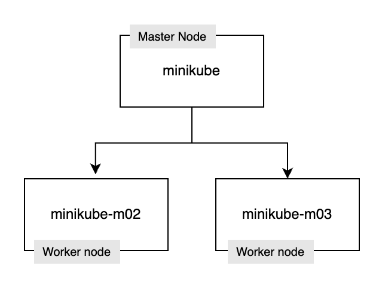
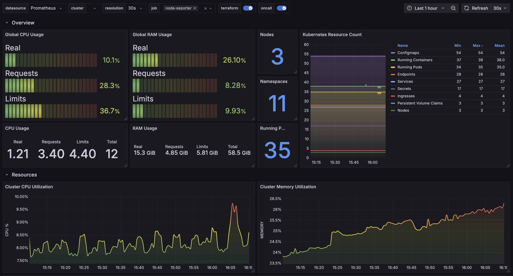
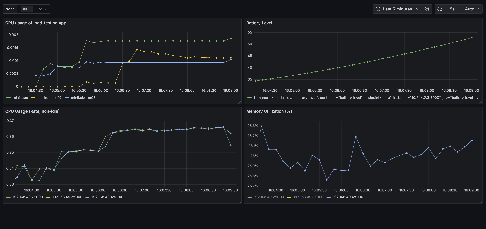
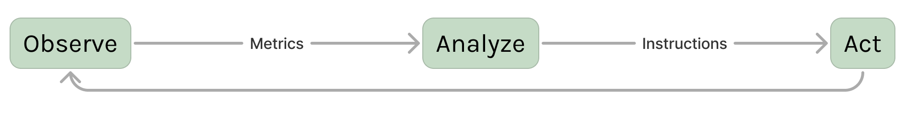

# Energy-Efficient Kubernetes Infrastructure: Testing Custom Operators for Carbon-Aware Workload Management

Research project focus on optimizing energy consumption by using data-driven decisions based on data collcted from within the cluster

## Repository structure
TODO: Tree

## Requirements
This guide outlines how to set up and test energy efficiency strategies in a Kubernetes environment using Minikube. Before beginning, ensure you have the following components installed and configured on your system:

### System Requirements

- **Operating System**: Windows 10/11, macOS, or Linux (Ubuntu 20.04+ recommended)
- **CPU**: Minimum 4 cores (8 cores recommended for better performance)
- **RAM**: Minimum 16GB (32GB recommended)
- **Storage**: At least 20GB of free disk space

### Required Software

1. **Docker** (version 20.10+)
   - Required for container management
   - [Download Docker](https://www.docker.com/products/docker-desktop/)

2. **Minikube** (version 1.30.0+)
   - Local Kubernetes implementation for testing
   - [Installation Guide](https://minikube.sigs.k8s.io/docs/start/)

3. **kubectl** (version compatible with your Minikube)
   - Command-line tool for interacting with Kubernetes clusters
   - [Installation Guide](https://kubernetes.io/docs/tasks/tools/)

4. **Helm 3**
   - Package manager for Kubernetes
   - [Installation Guide](https://helm.sh/docs/intro/install/)

5. **Git**
   - For cloning the repository containing configuration files
   - [Download Git](https://git-scm.com/downloads)

### Optional Tools

1. **Visual Studio Code** or another code editor
   - Helpful for editing YAML files and scripts
   - [Download VS Code](https://code.visualstudio.com/)

2. **kubectx** (Optional)
   - App used for switching between cluster contexts
   - [Installation Guide](https://github.com/ahmetb/kubectx)

### Clone the Repository

TODO: add repo URL
```bash
git clone https://github.com/yourusername/energy-efficient-k8s.git
cd energy-efficient-k8s
```

Once you have confirmed all prerequisites are met, you can proceed to the next section to set up your Minikube environment.

## Minikube Local Cluster Setup
Following these steps, you will setup a minikube cluster locally, which will serve as our test platform for applications

### Run Minikube cluster
Our application requires 3 nodes at minimum to simulate our use cases. In this setup, there is 1 control plane node and 2 worker nodes.
```bash
# Start minikube cluster with 3 nodes, each given a  4Gib of RAM and 4 cpu cores
minikube start --cpus=4 --memory=4096 --nodes=3
```

Run `kubectl get nodes` to validate  all 3 nodes are successfuly running in the cluster. Output should look something like this:
```bash
NAME           STATUS   ROLES           AGE   VERSION
minikube       Ready    control-plane   68d   v1.30.0
minikube-m02   Ready    <none>          68d   v1.30.0
minikube-m03   Ready    <none>          68d   v1.30.0
```

Our cluster diagram now looks like this:



### Environment setup
1. At first, we need to enable a ingress addon, so that our cluster can streamline requests to the cluster
    ```bash 
    minikube addons enable ingress
    ```

2. Install monitoring stack including node-exported, Prometheus and Grafana in a `monitoring` namespace
    ```bash
    helm repo add prometheus-community https://prometheus-community.github.io/helm-charts
    helm repo update

    helm install prometheus prometheus-community/kube-prometheus-stack \
        --namespace monitoring \
        --create-namespace \
        --wait
    ```

    Validate the setup by running `kubectl get pods -n monitoring`. You should see something like this:
    ```bash
    monitoring-grafana-cbf69b7bb-pswzn                       3/3     Running   63 (17h ago)   68d
    monitoring-kube-prometheus-operator-5dcbc8694b-jqmqx     1/1     Running   31 (17h ago)   68d
    monitoring-kube-state-metrics-7cbd6df958-nnpjf           1/1     Running   37 (24m ago)   68d
    monitoring-prometheus-node-exporter-4l74x                1/1     Running   21 (17h ago)   68d
    monitoring-prometheus-node-exporter-856qh                1/1     Running   21 (17h ago)   68d
    monitoring-prometheus-node-exporter-hwrjw                1/1     Running   21 (17h ago)   68d
    prometheus-monitoring-kube-prometheus-prometheus-0       2/2     Running   42 (17h ago)   68d
    ```
    This validates that Grafana, NodeExported and Prmetheus are running

3. Apply a `minikube/IaC/namespaces/monitoring/ingress.yaml` configuration file using `kubectl apply -f <filename>`. This will create an ingress resource pointing to the grafana service.

4. Open `/etc/hosts` and add this configuration, pointing the requests to **grafana.minikube.local** to the cluster: 
    ```txt
    127.0.0.1       grafana.minikube.local
    ```

5. Run `minikube tunnel` command, which will make ingress resources available from your local device. 

6. After that, open `http://grafana.minikube.local/` and login to grafana dashboard using default credentials
    ```bash
    login: admin
    password: prom-operator
    ```
7. (Optional) Add prepared grafana dashboards defined in `grafana-dashboards` folder. More about this in a [Grafana Dashbords](#grafana-dashboards)


## Grafana Dashboards
To monitor and visualize cluster status, we used dashboards provided by [grafana-dashboards-kubernetes](https://github.com/dotdc/grafana-dashboards-kubernetes). We also created multiple custom dashboards to validate correct operator's behaviour within the cluster.

To import a dashboard, navigate to `Grafana > Dashboards > New > Import`. Paste in a json code of the dashboard, then click Load and save. Dashbboard will appear in a list of available dashboards.

### Dashboards

| Dashboard Name | Preview | Download |
|----------------|---------|-------------------|
| Global View Dashboard |  | [Download](grafana-dashboards/exp1-grafana-dashboard.json) |
| Experiment 1 dashboard |  | [Download](https://github.com/dotdc/grafana-dashboards-kubernetes/blob/master/dashboards/k8s-system-api-server.json) |
| Experiment 2 dashboard **TODO** |  | [Download](https://github.com/dotdc/grafana-dashboards-kubernetes/blob/master/dashboards/k8s-system-coredns.json) |

## IaaC
Our Kubernetes configurations follow a namespace-centric directory hierarchy that mirrors the logical separation within the cluster itself. Each namespace has its own directory containing all related resources, with service-specific components further organized into subdirectories. This approach ensures clear boundaries between different applications and environments while maintaining a consistent structure that's easy to navigate and maintain.

```bash
IaaC/
└── namespaces/
    ├── <namespace-name>/
    │   ├── namespace.yaml       # Defines the namespace itself
    │   ├── ...                  # Additional namespaces related configuration files
    │   ├── ingress.yaml         # Ingress resources for external access
    │   └── <service-name>/      # Service-specific directory
    │       ├── deployment.yaml  # Defines Pods, replicas, and containers
    │       ├── service.yaml     # Exposes the deployment within the cluster
    │       └── ...              # Additional service related configuration files
```
- **Namespaces** - Each namespace is a separate folder in a `namespaces` folder. Folder name is the same as namespace name within the cluster. Each Namespace folder contains these files:
   - `namespace.yaml` defined namespace itself
   - `ingress.yaml` specifies how is the traffic from outside the cluster routed to the services
   - `<app_name>-cm.yaml` defines namespace related ConfigMap
   - ... Additional namespace related files
- **Services** - Each service has it's own directory within the namespace directory. Folder name of the service is the same as the name of a service within the cluster. Each service folder contains additonal files related to particular service:
   - `deployment.yaml` specifies which app is being deployed
   - `service.yaml` defines service itself
   - `<app_name>-cm.yaml` defines ConfigMap for the service
   - ... Additional service related files


## Applications

### Kubernetes Operators
Each operator runs as a **dockerized node.js app**. We are using `@kubernetes/client-node` library to communicate with kubernetes API to perform actions within the cluster. Another core library is `node-cron`, which allows us to execute functions periodically in a defined intervals.

Each operator code is split into several parts:
- `external` folder contains functions to communicate with outside world, for example communicating with external APIs.
- `k8s-management` folder contains code which monitors, creates or updates Kubernetes resources (deployments, nodeAffinity, ...).
- `monitorig` folder contains functions to communicate with Prometheus monitoring API within the cluster.
- `config.ts` contains operator related configuration to define it's behavior
- `main.ts` contains main operator loop to execute particular use case.

In general, Operators follow this pattern:


1. **Observe:** Monitor cluster state and energy metrics through Prometheus and external APIs (carbon intensity, energy prices)
2. **Analyze:** Compare current state to desired energy-optimized state using decision algorithms
3. **Act:** Implement changes via standard Kubernetes APIs (affinity rules, deployment scaling, pod placement)
4. **Repeat:** Continuously adapt to changing conditions on configurable intervals

Additional usecase specific information are provided inside each application's README.md file:
| Application | Description | Path |
|-------------|-------------|------|
| exp1 | **Operator for Usecase 1:** Prioritizing nodes with green energy sources  | [`applications/operators/exp1`](applications/operators/exp1) |
| exp2 | **Operator for Usecase 2:** Offloading tasks to periods of low carbon intensity | [`applications/operators/exp2`](applications/operators/exp2) |

### Simulation Applications
To simulate certain actions within the cluster, we used multiple simulator apps written in node.js, which are designed to run within the cluster ad dockerized applications. 

Their purpose is to simulate real world data which are provided to operator to execute it's use case. Additional information are provided inside each application's README.md file:

| Application | Description | Path |
|-------------|-------------|------|
| battery-charge-simulator | Simulates battery charge levels of a solar-powered node | [`applications/simulators/battery-charge-simulator`](applications/simulators/battery-charge-simulator) |
| kafka-message-publisher | Publishes test messages to Kafka topics for workload simulation | [`applications/simulators/kafka-message-publisher`](applications/simulators/kafka-message-publisher) |
| load-testing-app | Generates CPU and memory load to test resource management | [`applications/simulators/load-testing-app`](applications/simulators/load-testing-app) |
| task-runner | Executes scheduled tasks based on energy availability triggers | [`applications/simulators/task-runner`](applications/simulators/task-runner) |