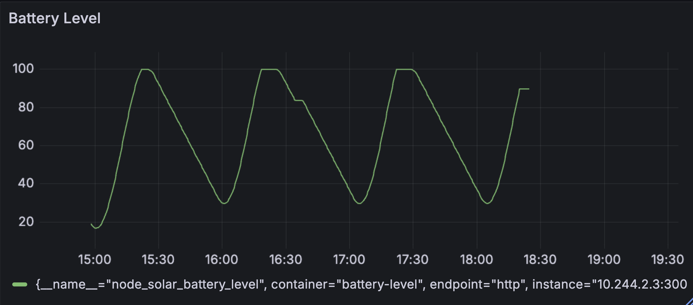

# Battery Charge Simulator
This Node.js application is used for Use case 1: Prioritizing nodes powered by green energy. It simulates a solar-powered node's battery behaviour by:
- Modeling solar power generation using a time-based irradiance calculation
- Dynamically updating battery levels based on solar input and node power consumption
- Exposing Prometheus metrics that track battery level, solar power input, and power consumption

The simulator helps the EXP1 operator test and validate strategies for prioritizing nodes with green energy sources by generating realistic battery charge and solar power data.

## Simulation cycle
When deployed to cluster, the application simulates battery level of a solar powered node. 

### Battery Parameters
- `batteryCapacity`: Total amount of energy the battery can store
- `consumptionRate`: Constant energy drain by the node's computing operations
- `PV_nominal`: Maximum power generation capacity of the solar panels
- `batteryEnergy`: Initial charge level when the simulation starts
- `maxIrradiance`: Maximum potential solar radiation used for calculating power generation

### Simulation Time Parameters
- `realDuration`: Actual wall-clock time for the entire simulation
- `simulatedDuration`: Length of time being simulated (full 24-hour cycle)
- `updateInterval`: Frequency of battery state updates
- `timeMultiplier`: Conversion factor to compress simulated time into real time

These parameters work together to create a realistic simulation of a solar-powered node's energy cycle.

